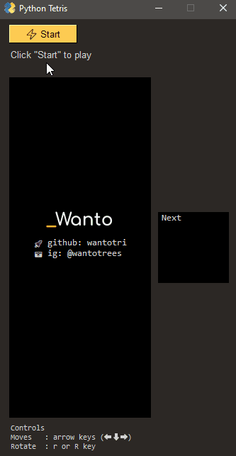

# Python Tetris

Created using Python 3.10.4

## How to Run the Game
In this project root directory:
1. [optional] Install and create virtual environment (venv)
2. Install dependencies `pip install -r requirements.txt`
3. Run the script `py tetris.py`

## In-game Keyboard Shortcut
* Create New Game: key `n` or `N`
* Pause/Resume the game: key `p` or `P`
* Move block to left: left arrow key `(⬅)`
* Move block to right: right arrow key `(➡)`
* Move block to bottom: down arrow key `(⬇)`
* Rotate block: key `r` or `R`
